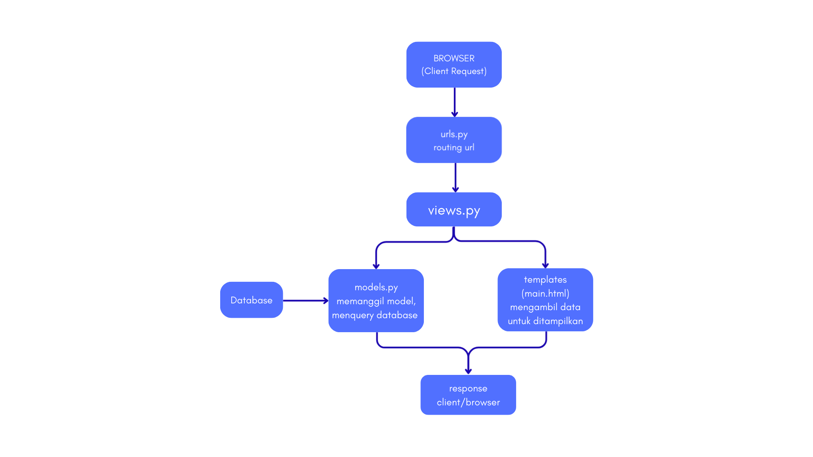
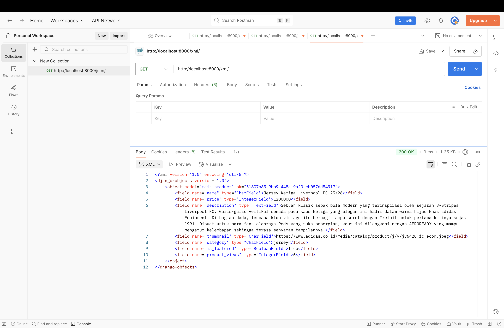
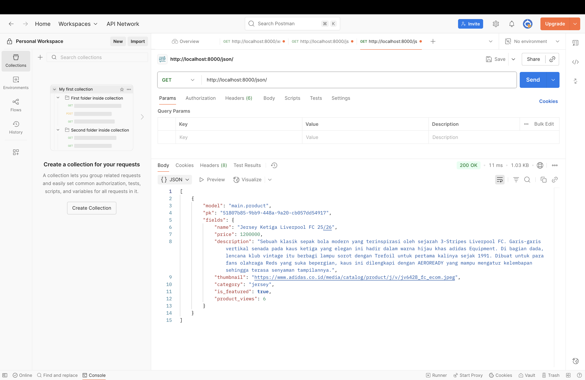

url pws : https://abelyvia-tori-streetkicks.pbp.cs.ui.ac.id/
TUGAS 2
Cara saya mengimplementasikan checklist adalah pada umumnya saya mengikuti tutorial yang diberikan dengan 
mencoba memahami per stepnya, membaca ppt untuk lebih memahami MVT pada jango itu seperti apa , bertanya kepada 
GPT untuk meminta penjelasan lebih lanjut tentang langkah demi langkah yang diberikan. 

peran settings.py pada proyek ini adalah mengatur production untuk keamanan
dan debugging, mengatur nama aplikasi django yang aktif dan akan digunakan 
dalam installed_apps dan mengatur allowed host untuk meluncurkan website, 
mengatur middleware yang diproses, mengatur koneksi database yang digunakan, melakukan autentikai dan validasi terhadap password. settings.py dijadikan pusat 
konfigurasi proyek django yang mengatur seluruh fitur perilaku dalam aplikasi django

cara kerja migrasi database di django adalah 
1. membuat model aplikasi django di models.py
2. membuat file migrasi dengan menjalankan python manage.py makemigrations
3. menerapkan perubahan pada migrasi yang dibuat dengan menjalankan python manage.py migrate
dengan ini django menyimpan informasi migrasi yang sudah dijalankan dan memungkinkan django untuk selalu cek apakah migrasi sudah berhasil dijalankan
migrasi ini membantu mengelola setiap perubahan database secara struktur dan otomatis 

alasan kenapa django dijadikan permulaan pembelajaran ini adalah 
1. struktur pemrograman web yang diberikan django terstruktur dan mudah untuk dipahami
2. banyak fitur bawaan dari framework ini seperti templates, autentikasi, admin, sehingga mengurangi kebutuhan ekstra library
3. berbasis bahasa python yang paling dasar dan mudah dipahami
4. django sesuai untuk kebutuhan pemrograman web berskala besar maupun kecil

feedback kepada asisten dosen untuk tutorial 1 :
mungkin karena tutorial 1 masih bisa dibilang tidak terlalu kompleks jadi mudah dipahami dan tidak terlalu banyak kendala. namun, kemarin saya sempat mengalami 
sedikit kendala dan langsung bertanya dan dibantu oleh kakak asdos untuk menyelesaikan masalah tersebut, terima kasih banyak kak, maaf kalau selama pengerjaan tugas2 ini agak banyak nanya huhuhu. 

TUGAS 3
1. Data delivery digunakan agar sebuah platform bisa melakukan pertukaran data antara client dan server. data delivery ini memungkinkan komunikasi dua arah 
sehingga aplikasi bersifat lebih interaktif

2. menurut saya, JSON lebih baik karena lebih ringan dan simple, support banyak bahasa pemrograman, XML lebih dapat digunakan jika data data yang digunakan lebih kompleks. saat ini, JSON lebih populer karena lebih efisien digunakan untuk API dan web service.

3. is_valid digunakan untuk memvalidasi input form dimana django akan memeriksa apakah data form sudah sesuai . hal ini berguna untuk cek semua data yang masuk
ke database sudah konsisten dan aman

4. csrf_token ini adalah mekanisme proteksi yang dibuat terhadap cross site request forgery yang kalau tidak ditambahkan akan ada kemungkinan 
user bisa mengirim request berbahaya pada server
 
5. yang pertama saya melakukan sesuai di tutorial yaitu menambahkan fungsi views dan membuat fitur add product pada aplikasi lalu saya langsung mencoba untuk menjalankan keseluruhan nya di browser, ketika sudah berhasil saya baru melakukan pengembalian data pada xml json dan menambahkan url nya di urls.py dan 
melakukan pengujian kepada setiap url yang ada, lalu saya menggunakan postman untuk cek hasilnya setelah itu membuat readme menjawab pertanyaan dan mencoba menjalankan lagi push ke github lalu push ke pws 

6. tidak ada karena tugas kali ini gak banyak nanya kakak asdos,,, terima kasih banyak kaks

